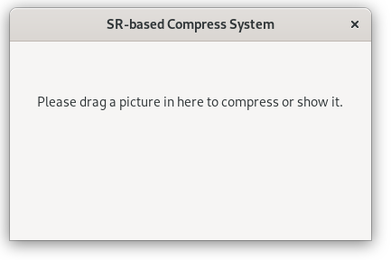
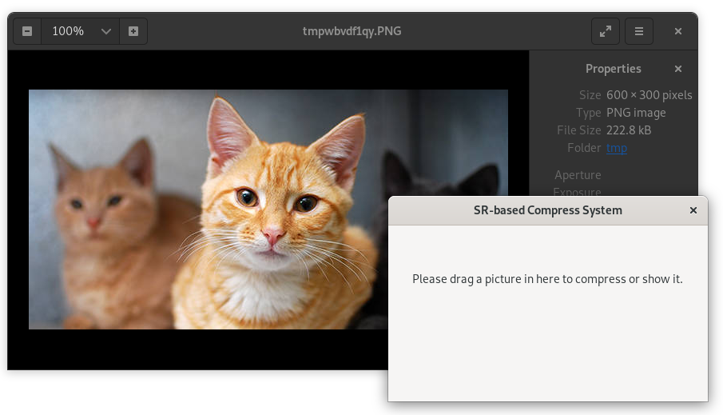
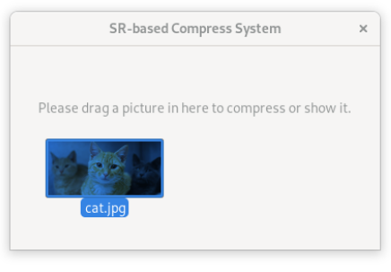
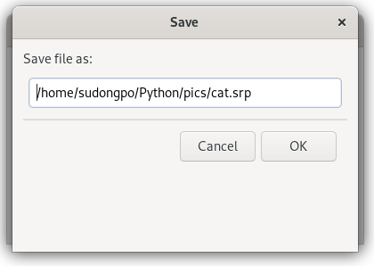

# SR-based Compress System

## Introduction
SR-based Compress System, combines the traditional image compress algorithm such as `JPEG` and Super-resolution algorithm whose abbreviation is `SR` to compress/decompress images. And the specified file with suffix '`·srp`' is the compressed image in this system.  
Coding in python, so using this software only requires a computer with python and PyPI environment installed, whether any Linux distributions or Windows.

## User Guide

### Installation

1. Install ISR from PyPI

```bash
pip install --user ISR
```

2. Install wxPython from PyPI

```bash
pip install --user wxPython
```

3. Clone or download this repo


### Usage

#### Run the software

In Linux, use `cd` to change directory to the root directory of this repo, and then use the following commond.  
```bash
./srp
```

In Windows, double click the `srp.bat`.  



#### Show a `.srp` picture

drag it into the window of `SR app`.



#### Convert a picture into `srp` format

drag it into the window, enter output filename, click OK button and wait till it finished.





### Thanks

[image-super-resolution](https://github.com/idealo/image-super-resolution)

### Contributors

[xieshiyao](https://github.com/xieshiyao)
